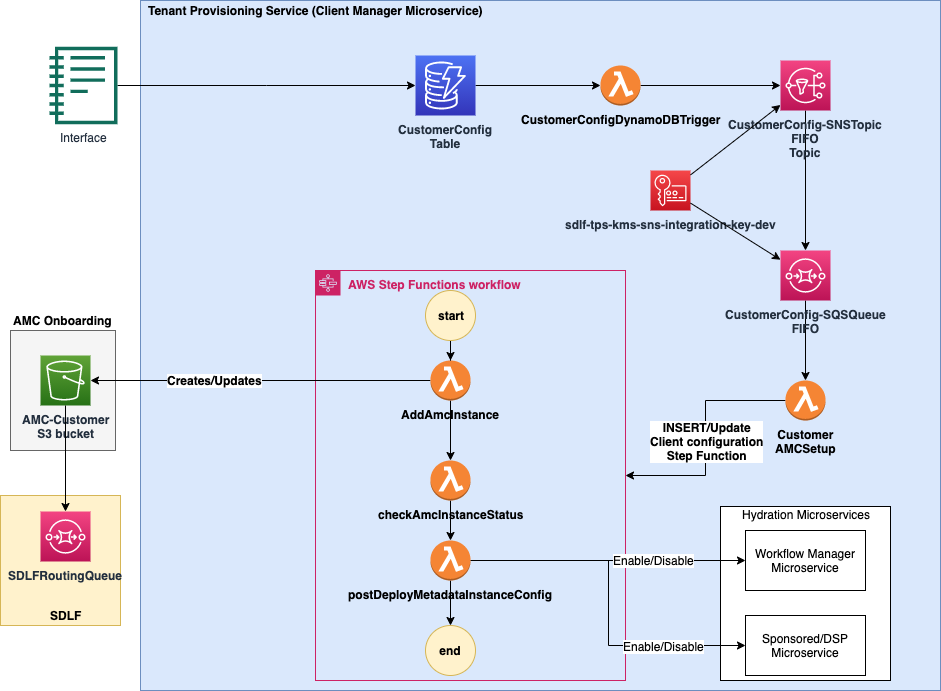

# Tenant Provisioning Service (Client Manager MicroService)
The Tenant Provisioning Service is part of the Client Manager MicroServices package, it is an Amazon Ad Tech solution that adds functionality for managing multiple Amazon Marketing Cloud clients. 

**Purpose**
* The Purpose of the Tenant Provisioning Service is to allow AMC/Sponsored Ads/DSP users to automate the onboarding of multiple clients on the Amazon Ad Tech platform without having to develop custom solutions. Below is a list of the features of the service.

**Ability to add new customers using configuration**
* TPS provides an ability to onboard clients using configuration which is persisted in a DynamoDB Table. It helps to reduce time to onboard new customers.

**Enable different modules for each clients**
* TPS provides functionality to automatically enable different modules (AMC/Sponsored ADs/DSP) during the onboarding process for each client.

**Multi-tenant Support**
* TPS provides a centralized location to manage various clients and modules and supports multi-tenancy.

**Contents:**

* [Reference Architecture](#reference-architecture)
* [Prerequisites](#prerequisites)
* [AWS Service Requirements](#aws-service-requirements)
* [Resources Deployed](#resources-deployed)
* [Deploying the CICD pipelines](#deploying-the-cicd-pipelines)
* [Parameters](#parameters)

## Reference Architecture

## Prerequisites
1. The below resources are deployed as part of the SDLF (Serverless Datalake Package) package but it can deployed manually to only use the TPS MicroService. Refer the SDLF (Serverless Datalake Package) package deployment steps.
    1. Parameter Store /SDLF/KMS/KeyArn
    2. Parameter Store SDLF/Lambda/${pTeamName}/LatestDatalakeLibraryLayer
    3. Parameter Store /SDLF/Lambda/${pTeamName}/PowerTools
    4. Parameter Store /SDLF/S3/CFNBucket
    5. Parameter Store /SDLF/IAM/${TEAM}/CloudWatchRepositoryTriggerRoleArn
    6. Parameter Store /SDLF/IAM/${TEAM}/CodePipelineRoleArn
2. AWS Account
3. Deployed the CICD pipelines.
3. IDE for  e.g. [Pycham](https://www.jetbrains.com/pycharm/) or [AWS Cloud9](https://aws.amazon.com/cloud9/)
5. [AWS CLI](https://docs.aws.amazon.com/cli/latest/userguide/install-cliv2.html)

## AWS Service Requirements

The following AWS services are required for this utility:

 1. [AWS Lambda](https://aws.amazon.com/lambda/)
 2. [S3](https://aws.amazon.com/s3/)
 3. [Amazon Cloudwatch](https://aws.amazon.com/cloudwatch/)
 4. [Amazon DynamoDB](https://aws.amazon.com/dynamodb/)
 5. [AWS Identity and Access Management (IAM)](https://aws.amazon.com/iam/)
 6. [AWS Step Functions](https://aws.amazon.com/step-functions/)
 7. [Amazon Simple Queue Service](https://aws.amazon.com/sqs/)
 8. [Amazon Simple Notification Service](https://aws.amazon.com/sns/)
 9. [AWS Key Management Service (KMS)](https://aws.amazon.com/kms/)
  
## Resources Deployed
This template deploys the following resources:
1. Deploys the CloudFormation stack for `TPS`, as defined in the `template.yaml` of the repository.

## Deploying the CICD pipelines
This can be done while deploying the TPS initialization package. It executes the `./deploy-init.sh` and deploys the below rsources.
1. Codepipeline - Deploys the CloudFormation stack for `TPS`, as defined in the `template.yaml` of the repository.
2. CloudWatch Rules — Triggers the pipeline upon changes to the CodeCommit repositories containing the code.

### Parameters
Before deploying a new pipeline, ensure that the `parameters-$ENV.json` file contains the following parameters that the **PIPELINE** stack requires:

1. `pMicroserviceName` [***REQUIRED***] — Name of the microservice.
2. `pPipelineName` [***REQUIRED***] — Name to give the pipeline being deployed.
3. `pTeamName` [***REQUIRED***] — The name of the team which owns the pipeline.
4. `pEnvironment` [***REQUIRED***] — The name of the branch which is configured while deploying the CICD pipeline

The required parameters MUST be defined in a `parameters-$ENV.json` file at the same level as `deploy.sh`. The file should look like the following:

      [
            {
                "ParameterKey": "pMicroserviceName",
                "ParameterValue": "tps"
            },
            {
                "ParameterKey": "pPipelineName",
                "ParameterValue": "cmpl"
            },
            {
                "ParameterKey": "pTeamName",
                "ParameterValue": "<teamname>"
            },
            {
                "ParameterKey": "pEnvironment",
                "ParameterValue": "dev"
            }
      ]

A tags.json file in the same directory can also be amended to tag all resources deployed by CloudFormation.

### Deployment
Run this command from the root directory:

    ./deploy.sh

***Important**: Note that the arguments to the script can be left out and defaults will be used. The script works for both creating, as well as updating, CloudFormation stacks. Please ensure that the parameters defined in `parameters-$ENV.json` are correct.

The arguments are as follows:
1. `s` — Name of the S3 bucket used for uploading any CloudFormation artifacts to.
2. `p` — AWS profile to use, as listed in `~/.aws/credentials`. Defaults to `default`. 
3. `h` — Displays a help message.
   
Wait for the CloudFormation stack to complete the deployment of all the infrastructure before proceeding further.
