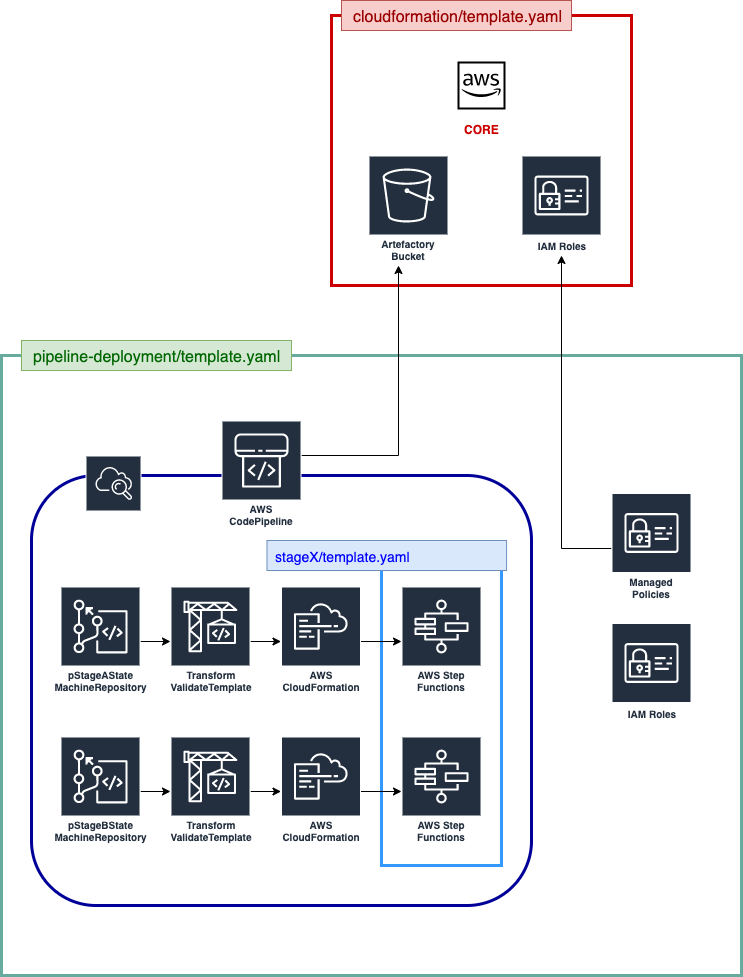

# README 
This repository contains the code that enables the deployment of a new pipeline and the stages it's composed of (pre-stage, post-stage, analytics-stage...)
 
## Prerequisites
Before attempting to deploy a pipeline, ensure that the **CORE** and **TEAM** infrastructure has completed its provisioning, and has been successfully deployed. They contain resources that the **PIPELINE** stack depends on, and without them in place, the deployment of this stack will fail. These resources include:
1. IAM roles
2. S3 buckets

## Resources Deployed
In detail, this template deploys the following resources:
1. CodePipeline
   1. `StageA` — Deploys the CloudFormation stack for `StageA`, as defined in the `template.yaml` of the State Machine's repository.
   2. `StageB` — Deploys the CloudFormation stack for `StageB`, as defined in the `template.yaml` of the State Machine's repository.
2. CloudWatch Rules — Triggers the pipeline upon changes to the CodeCommit repositories containing the code for the State Machines.

## Deploying a pipeline

### Parameters
Before deploying a new pipeline, ensure that the `parameters-$ENV.json` file contains the following parameters that the **PIPELINE** stack requires:

1. `pTeamName` [***REQUIRED***] — Name of the team as defined in `common-team` that will be owning this pipeline.
2. `pPipelineName` [***REQUIRED***] — Name to give the pipeline being deployed.
3. `pStageAStateMachineRepository` — The name of the repository containing the code for StageA's State Machine. Each pipeline has its own State Machine. Defaults to `stageA`.
4. `pStageBStateMachineRepository` — The name of the repository containing the code for StageB's State Machine. Each pipeline has its own State Machine. Defaults to `stageB`.
5. `pStageABranch` — Name of the branch to release changes from. This branch will contain any feature releases for the StageA Machine. If we want a specific feature to be unique and be present in only one of the pipelines, then that code should be released to a branch, and the name of that branch should be given here. That way, a `git push` operation to the given branch will only trigger this specific pipeline's CodePipeline. Defaults to `master`, which will cause a `git push` operation to trigger the CodePipelines across all pipelines (`master` is shared across all pipelines).
6. `pStageBBranch` — Name of the branch to release changes from. This branch will contain any feature releases for the StageB Machine. If we want a specific feature to be unique and be present in only one of the pipelines, then that code should be released to a branch, and the name of that branch should be given here. That way, a `git push` operation to the given branch will only trigger this specific pipeline's CodePipeline. Defaults to `master`, which will cause a `git push` operation to trigger the CodePipelines across all pipelines (`master` is shared across all pipelines).

The required parameters MUST be defined in a `parameters-$ENV.json` file at the same level as `deploy.sh`. The file should look like the following:

      [
            {
                  "ParameterKey": "pTeamName",
                  "ParameterValue": "<teamName>"
            },
            {
                  "ParameterKey": "pPipelineName",
                  "ParameterValue": "<pipelineName>"
            },
            {
                  "ParameterKey": "pStageAStateMachineRepository",
                  "ParameterValue": "sdlf-<teamName>-stageA"
            },
            {
                  "ParameterKey": "pStageBStateMachineRepository",
                  "ParameterValue": "sdlf-<teamName>-stageB"
            },
            {
                  "ParameterKey": "pStageABranch",
                  "ParameterValue": "<branchName>"
            },
            {
                  "ParameterKey": "pStageBBranch",
                  "ParameterValue": "<branchName>"
            }
      ]

A tags.json file in the same directory can also be amended to tag all resources deployed by CloudFormation.

### Deployment
Run this command from the root directory:

    ./deploy.sh -n <PIPELINE_NAME> -s <S3_BUCKET_NAME> -p <AWS_CREDENTIAL_PROFILE>

For example, the command in the next line creates a CloudFormation stack named `<pTeamName>-main` using the credentials defined in `~/.aws/credentials` with the profile name `my-aws-profile`. Any CloudFormation artifacts are uploaded to the `my-dl-bucket`:

    ./deploy.sh -n main -s my-dl-bucket -p my-aws-profile

***Important**: Note that the arguments to the script can be left out and defaults will be used. The script works for both creating, as well as updating, CloudFormation stacks. Please ensure that the parameters defined in `parameters-$ENV.json` are correct.

The arguments are as follows:
1. `n` — Name of the pipeline which is used in combination with the team name as the CloudFormation stack name.
2. `s` — Name of the S3 bucket used for uploading any CloudFormation artifacts to.
3. `p` — AWS profile to use, as listed in `~/.aws/credentials`. Defaults to `default`. 
4. `h` — Displays a help message.
   
Wait for the CloudFormation stack to complete the deployment of all the infrastructure before proceeding further.

## Architecture
The diagram below illustrates the high-level architecture of the resources deployed by this template:

This template creates the following resources:
1. CICD pipelines for the State Machines (one per stage)
2. CloudWatch pipelines trigger rules