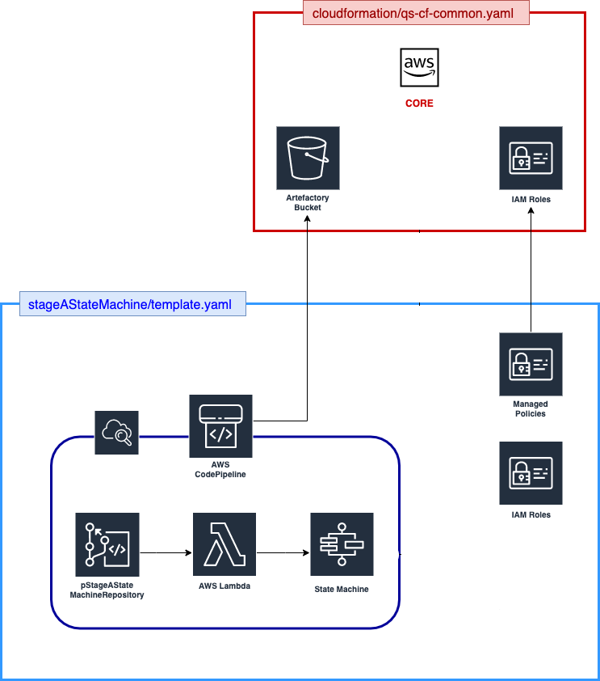

# StageA State Machine
This repository contains the code for the StageA State Machine. The CloudFormation stack in this repository is deployed by the CICD pipeline created by the **PIPELINE** stack, and thus should not be deployed manually.

## Architecture
The diagram below illustrates the high-level architecture of the resources deployed by this template:

This template creates the following resources:
1. SQS Queues
2. Lambda functions
3. State Machine
4. IAM roles
5. IAM managed policies
6. CloudWatch Alarms

## Resources Deployed
In detail, this template deploys the following resources:
1. Queues
   1. `rQueueRoutingStep`
   2. `rDeadLetterQueueRoutingStep`
2. IAM
   1. `rRoleLambdaExecutionRoutingStep`
   2. `rRoleLambdaExecutionStep1`
   3. `rRoleLambdaExecutionStep2`
   4. `rRoleLambdaExecutionStep3`
   5. `rRoleLambdaExecutionErrorStep`
3. Lambda
   1. `rLambdaRoutingStep`
   2. `rLambdaRedriveStep`
   3. `rLambdaStep1`
   4. `rLambdaJobCheckStep`
   5. `rLambdaStep2`
   6. `rLambdaStep3`
   7. `rLambdaErrorStep`
4. CloudWatch Alarms
   1. `rLambdaErrorStepCloudWatchAlarm`
   2. `rLambdaRoutingStepCloudWatchAlarm`
5. State Machine
   1. `rStateMachine`

Optional (i.e. Elasticsearch Enabled):
1. Log Groups (one per Lambda Function)
2. UpdateSubscriptionFilters (one per Lambda Function)

## Deployment
This stack should **not** be deployed manually. CodePipeline will trigger upon any `git push` operation to the repository containing this stack, releasing changes automatically. All parameters are passed into this stack through CodePipeline from the **PIPELINE** stack.
