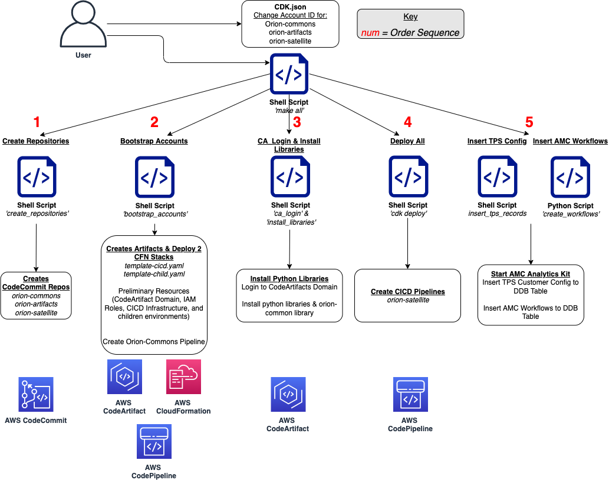
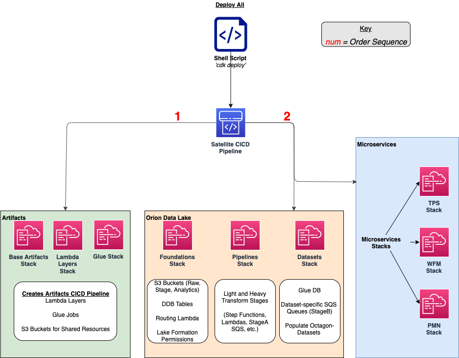
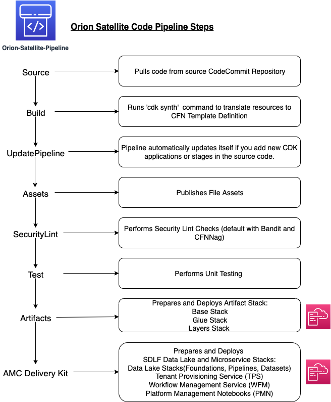

# quickstart-amazon-marketing-cloud—Quick Start

## Prerequisites

There are two options for how to deploy this QuickStart: [Using AWS Cloud9](#using-aws-cloud9) or [Deploying Locally using AWS CLI](#deploying-locally-using-aws-cli).

### Deploying Locally using AWS CLI

1. Log in to the AWS account console using the Admin role and select an AWS region. We recommend choosing a mature region where most services are available (e.g. eu-west-1, us-east-1…)
2. Navigate to AWS Lake Formation. If this is the first time you visit the page, you might be asked to add yourself as a Data Lake administrator which you can accept. Then, click on `Settings` on the left-hand side menu and make sure both boxes are unchecked before clicking save.
3. Verify that you have the [prerequisites](https://docs.aws.amazon.com/cdk/latest/guide/getting_started.html#getting_started_prerequisites) to install the AWS CDK.
4. [Install the AWS CDK](https://docs.aws.amazon.com/cdk/latest/guide/getting_started.html#getting_started_install).
5. [Install the AWS CLI](https://docs.aws.amazon.com/cli/latest/userguide/getting-started-install.html)
6. Download the package, upload it to your IDE (for e.g. [Pycharm](https://www.jetbrains.com/pycharm/)), and unzip it
7. Configure the AWS CLI with a profile by using the configure command, as follows:

```
aws configure
```

When prompted, specify the AWS access key and AWS secret access key of the IAM user to use with CodeCommit. Also, be sure to specify the AWS Region where the repository exists, such as us-east-1. When prompted for the default output format, specify json. For example, if you are configuring a profile for an IAM user:

```
AWS Access Key ID [None]: Type your IAM user AWS access key ID here, and then press Enter
AWS Secret Access Key [None]: Type your IAM user AWS secret access key here, and then press Enter
Default region name [None]: Type a supported region for CodeCommit here, and then press Enter
Default output format [None]: Type json here, and then press Enter
```

Continue to the [How to Deploy](#how-to-deploy) Section in order to deploy this QuickStart.

### Using AWS Cloud9

1. Log in to the AWS account console using the Admin role and select an AWS region. We recommend choosing a mature region where most services are available (e.g. eu-west-1, us-east-1…)
2. Navigate to AWS Lake Formation. If this is the first time you visit the page, you might be asked to add yourself as a Data Lake administrator which you can accept. Then, click on `Settings` on the left-hand side menu and make sure both boxes are unchecked before clicking save.
3. Navigate to `Cloud9` in the AWS console. Set up a [Cloud9 Environment](https://docs.aws.amazon.com/cloud9/latest/user-guide/create-environment-main.html) in the same AWS region (t3.small or higher, Amazon Linux 2) and open the IDE
4. Download the package, upload it to your Cloud9 instance, and unzip it

Continue to the [How to Deploy](#how-to-deploy) Section in order to deploy this QuickStart.

#

## How To Deploy

1. Locate three separate **cdk.json** files located under the **orion-commons/**, **orion-artifacts/**, and **orion-satellite/** repositories and customize it to your environment:
   - NOTE: You **must** change the account and domain_owner parameters in cicd and account parameters in dev (the child account) to match your own AWS Account IDs. The AWS Account IDs in cicd and dev can be the same value to deploy the Quickstart in a single account or different from one another if you wish to deploy the resources in a separate child account. An example of the cdk.json structure is below:

```
{
    ...
    "environments": {
      "cicd": {
        "account": "111111111111", #FIX
        "region": "us-east-1",
        "codeartifact": {
          "repository": "orion-commons",
          "domain": "orion",
          "domain_owner": "111111111111" #FIX
        },
        "execute_security_lint": true
      },
      "dev": {
        "account": "222222222222", # FIX: Child environment AWS account ID can be different from the CI/CD stage
        "region": "us-east-1",
        "name": "Development",
        "manual_approvals": false,
        "resource_config": {
          "artifacts-bucket": {"versioned": false, "removal_policy": "destroy"},
          "athena-bucket": {"versioned": false, "removal_policy": "destroy"},
          "artifacts-bucket-key": {"enable_key_rotation": true, "removal_policy": "destroy"},
          "athena-bucket-key": {"enable_key_rotation": true, "removal_policy": "destroy"}
        }
      }
    },
    ...
  }
}
```

- Other customizations include:
  - Changing/Adding child environments (e.g. dev, test). Adding a new child environment (say test or prod) would be as simple as adding a new entry in this JSON file with relevant configuration and pushing it to the source repository. The pipeline will then self-mutate and deliver the same infrastructure in the new child environment.
  - Changing region to a new AWS Region name.
  - Whether to execute a security check stage (true or false; default true)
  - Whether manual approval is required
  - Environment specific infrastructure configuration such as the removal policy and versioning status of S3 buckets.

2. Initialize a Python Virtual Environment by running the command:

```
`python -m venv .env && source .env/bin/activate`
```

The virtual environment here is used to manage Python packages and library for the quickstart without installing them globally.

3. Install JQuery on your local environment by running the command:

```
sudo yum install jq
```

4. From within the **quickstart-amazon-marketing-cloud** repository run:

```
make all
```

Congratulations! Orion is now being deployed in your AWS Account. The deployment takes approximately 2 hours to complete. As you wait, take some time to read the additional documentation on what the make all command is deploying in your account [below](#make-all-command-deployment).

#

## Make All Command Deployment

The Makefile goes through a series of 5 steps to deploy this Quickstart in your AWS account: [Create Repositories](#create-repositories), [Bootstrap Accounts](#bootstrap-accounts), [CA Login & Install Libraries](#CA-login-and-install-libraries), [Deploy All](#deploy-all), and [Insert TPS Config & AMC Workflows](#insert-TPS-records-and-AMC-workflows).



A more detailed explanation of each step is below:

### Create Repositories

The deployment starts by provisioning and populating three AWS CodeCommit repositories in the account. As Orion relies on a CI/CD approach, you have initialized code repositories hosting the infrastructure as code. These three repositories are **orion-commons**, **orion-artifacts**, and **orion-satellite**.

### Bootstrap Accounts

Next, [bootstrap](https://docs.aws.amazon.com/cdk/v2/guide/bootstrapping.html) the account to deploy AWS infrastructure required by the CDK and Orion to manage Infrastructure As Code (IaC). The AWS Infrastructure deployed includes IAM Roles, an AWS CodeArtifacts Domain, and Orion helper functions and resource factories. To do so, the framework provisions two AWS CloudFormation stacks: **orion-cicd-bootstrap** and **orion-dev-bootstrap**.

When the bootstrap stacks are deployed, a CodePipeline pipeline named **orion-commons-pipeline** is automatically triggered. It pulls code from the **orion-commons** repository and creates a Python library with the same name hosted in CodeArtifact

The AWS Lake Formation access control model was also enabled in the data lake.

### CA Login and Install Libraries

_CA Login:_ Now that the **orion-commons** library is available, it can be installed on locally. To do that, we must first connect to the CodeArtifact repository and establish a link between the CodeArtifact private repository and the local environment.

_Install Libraries:_ The second command installs a number of Python libraries locally including **orion-commons**.

### Deploy All

The deploy all step deploys two AWS CodePipelines, **orion-artifacts** and **orion-satellite**, along with their respective AWS. The pipelines will self-mutate based on any added child environments or stages and deliver the same infrastructure in the new child environment. A number of stages are added by default to the CodePipeline(e.g. security checks with [Bandit](https://github.com/PyCQA/bandit) and [CFNNag](https://github.com/stelligent/cfn_nag), and a testing phase). If you recall from the previous phase, these were defined in the Orion Commons library and are now used within the Orion Artifacts and Orion Satellite applications to comply with best practices specified centrally.

The last stage of each pipeline delivers the artifacts and satellite infrastructure respectively in the child (dev) environment through CloudFormation.



_Orion-Artifacts:_ This application creates shared resources between teams. These resources include Lambda Layers, Glue Jobs, and a S3 Bucket to host the Artifacts.

_Orion-Satellite:_ This application creates the resources for the Data Lake and supporting Microservices. All the resources needed for orchestration between services, data processing code, and data and metadata storage are provisioned here. For a walkthrough of the steps the AWS CodePipeline goes through to deploy these resources please refer to [here](#orion-satellite-codepipeline-steps).

### Insert TPS Records and AMC Workflows

_Insert TPS Records:_ To initialize the process of onboarding your AMC instance on the Amazon AD Tech platform, this script adds client configurations to a TPS Customer Configuration table in Amazon DynamoDB. The configuration includes your AMC Endpoint URL, AMC Bucket Name and other related information on your AMC Instance. The Tenant Provisioning Service (TPS) will then automatically:

- Onboard clients using configuration which is persisted in a DynamoDB Table. It helps to reduce time to onboard new customers
- Provide functionality to automatically enable different modules (AMC/Sponsored ADs/DSP) during the onboarding process for each client
- Provide a centralized location to manage various clients and modules and supports multi-tenancy

_Insert AMC Workflows:_ To initialize the creation, scheduling and execution of AMC workflows, this script adds 4 default workflows to an AMC Workflows Library table in Amazon DynamoDB. From there Workflow Manager Service (WFM) will automatically create workflow schedules and add them to your AMC instance. WFM also allows you to:

- Automatically trigger the deployment of the SQS queues, IAM policies, workflows and workflow schedules in WFM for the customer's AMC instance upon adding or updating a customer record to the Tenant Provisioning Service (TPS)
- Synchronize workflows and workflow schedules in the Workflow Library service with multiple AMC Instances
- Send execution requests to an SQS queue rather than directly to the AMC endpoint to prevents timeout failures when there are large number of requests in a short period of time
- Scheduled with dynamic relative time windows rather than using AMC's scheduling feature which only allows predefined scheduled reporting such as Daily or Weekly
- Track the status of all workflow executions for customer AMC instances whether they are submitted through WFM or other means (postman, etc.). Having the status synced to DynamoDB allows events to be triggered or notifications to be sent when executions change state. This table can also be used to track historical executions for troubleshooting or performance monitoring.

#

## Orion Satellite CodePipeline Steps

The Code Pipeline Steps (as shown to the right) are:

- Source → Pull code from the source CodeCommit Repository
- Build → Runs `cdk synth` to translate CDK defintions into CloudFormation Template Definitions
- UpdatePipeline → Automatically update if new CDK applications or stages are added in the source code
- Assets → Publish CDK Assets
- SecurityLint → Perform security checks (default with [Bandit](https://github.com/PyCQA/bandit) and [CFNNag](https://github.com/stelligent/cfn_nag))
- Test → Performs Unit Testing
- Orion Satellite → Prepares and Deploys the Data Lake Resources in CloudFormation Stacks
- Orion Microservices → Prepares and Deploys the Microservice Resource in CloudFormation Stacks (TPS, WFM, and PMN)
- Orion Satellite Event Rule → Prepares and Deploys a CloudFormation Stack to trigger CodePipeline to run whenever Orion Artifacts CodePipeline Completes



#

## Additional Resources

For more Information on Orion: (Link to Open Source Code Once Avalaible)

To clean up your environment, please read the clean up documentation located [here](Cleanup.md)

To post feedback, submit feature ideas, or report bugs, use the **Issues** section of this GitHub repo.

To submit code for this Quick Start, see the [AWS Quick Start Contributor's Kit](https://aws-quickstart.github.io/).
