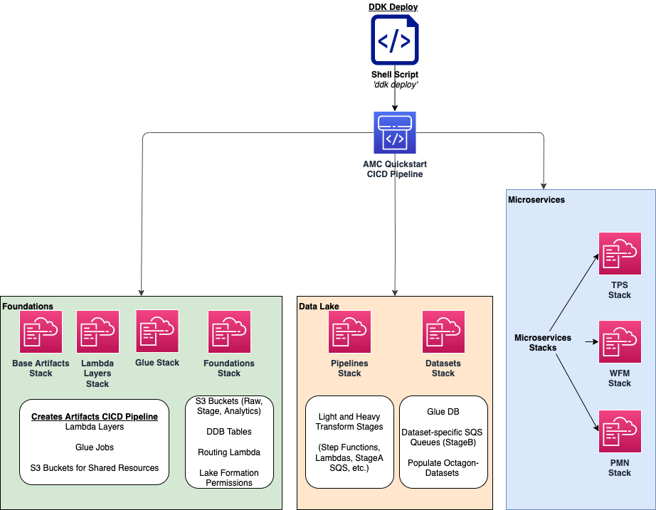
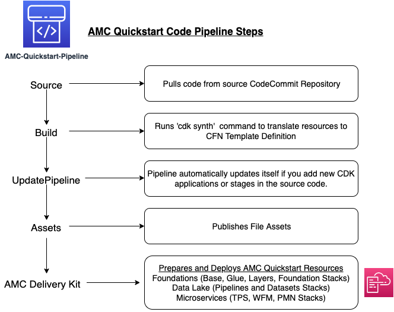

# Deployment Steps for AMC QuickStart

#

## Prerequisites for the Deployment

To complete this deployment, you'll need the following in your local environment

Programmatic access to an AWS Account
Python (version 3.7 or above) and its package manager, pip (version 9.0.3 or above), are required

```
$ python --version
$ pip --version
```

The AWS CLI installed and configured

```
$ aws --version
```

The AWS CDK CLI (version 2.10 and above) installed

```
$ cdk --version
```

The Git CLI installed and configured

```
$ git --version
```

If this is your first time using Git, set your git username and email by running:

```
$ git config --global user.name "YOUR NAME"
$ git config --global user.email "YOU@EMAIL.COM"
```

You can verify your git configuration with

```
$ git config --list
```

### [OPTIONAL] Using AWS Cloud9 for Deployment:

If you would like to deploy this quickstart using an AWS Cloud9 Environment rather than on your local environment, follow these steps to set up AWS Cloud9:

1. Log in to the AWS account console using the Admin role and select an AWS region. We recommend choosing a mature region where most services are available (e.g. eu-west-1, us-east-1…)
2. Navigate to `Cloud9` in the AWS console. Set up a [Cloud9 Environment](https://docs.aws.amazon.com/cloud9/latest/user-guide/create-environment-main.html) in the same AWS region (t3.small or higher, Amazon Linux 2) and open the IDE
3. Download the package, upload it to your Cloud9 instance, and unzip it

Python, Pip, AWS CLI, AWS CDK CLI, and Git CLI packages should all be installed and configured for you by defualt in your Cloud9 environment. Ensure that these pacakges are installed with the correct version with the following commands:

```
$ python --version
$ pip --version
$ aws --version
$ cdk --version
$ git --version
```

The version requirements for the packages installed are:
Python (version 3.7 or above)
pip (version 9.0.3 or above)
AWS CDK CLI (version 2.10 and above)

Continue to the [Initial setup with the DDK CLI](#Initial-setup-with-the-DDK-CLI) Section in order to deploy this QuickStart.

#

## Initial setup with the DDK CLI

Clone the repository for AMC QuickStart

```
$ git clone GITHUB-PATH
$ cd amc_quickstart
```

Install AWS DDK CLI, a command line interface to manage your DDK apps

```
$ pip install aws-ddk
```

To verify the installation, run:

```
$ ddk --help
```

Create and actitavte a virtualenv

```
$ python -m venv .venv && source .venv/bin/activate
```

Install the dependencies from requirements.txt
This is when the AWS DDK Core library is installed

```
$ pip install -r requirements.txt --no-cache-dir
```

If your AWS account hasn't been used to deploy DDK apps before, then you need to bootstrap your environment:

```
$ ddk bootstrap --help
$ ddk bootstrap --profile [AWS_PROFILE] --trusted-accounts [AWS_ACCOUNT_ID]
```

You might recognize a number of files typically found in a CDK Python application (e.g. app.py, cdk.json...). In addition, a file named ddk.json holding configuration about DDK specific constructs is present. Edit the DDK file with right account id, the name of the CodeCommit repository to reference (you will create this repository at a later step)and other data lake parameters (i.e. app, org, team, dataset, and pipeline names).

```
$ Edit ddk.json
```

Initialise git for the repository

```
$ git init --initial-branch main
```

Execute the create repository command to create a new codecommit repository

_(Make Sure the AMC_QUICKSTART_REPO_NAME matches the `repository` name value in the `ddk.json` configuration file before executing)_

```
$ ddk create-repository AMC_QUICKSTART_REPO_NAME --profile [AWS_PROFILE] --region [AWS_REGION]
```

Add and push the initial commit to the repository

```
$ git add .
$ git commit -m "Configure AMC QUICKSTART"
$ git push --set-upstream origin main
```

#

## Deploying the Quickstart

Once the above steps are performed, run the deploy command to deploy the quickstart

```
$ ddk deploy --profile [AWS_PROFILE]
```

The deploy all step deploys an AWS CodePipeline along with its respective AWS CloudFormation Stacks. The last stage of each pipeline delivers the AMC Quickstart infrastructure respectively in the child (default dev) environment through CloudFormation.



_Foundations:_ This application creates the foundational resources for the quickstart. These resources include Lambda Layers, Glue Jobs, S3 Buckets, routing SQS Queues, and Amazon DynamoDB Tables for data and metadata storage.

_Data Lake:_ This application creates the resources for the data lake. All the resources needed for orchestration between services and data processing code are provisioned here.

_Microservices:_ This application creates the resources for the supporting Microservices. All the resources needed for orchestration between the microservices, data processing code, and data and metadata storage for the microservices are provisioned here.

For a walkthrough of the steps the AWS CodePipeline goes through to deploy these resources please refer to [here](#amc-quickstart-codepipeline-steps).

_NOTE:_ If deploying in a new AWS Account, the Assets stage of the CodePipeline may fail due to limitations for the number of concurrent file assets to publish. This is a current limitation of AWS CodeBuild. To fix, click the `Retry` button in CodePipeline for the Assets Stage. This will manually continue the Assets Stage to continue building file assets from its most current progress.

#

## Hydrating the Data Lake with SageMaker Notebooks

To hydrate the data lake and begin populating the data lake with data from your AMC Instance, follow the steps below:

1. Log In to your AWS Account and go to Amazon SageMaker
2. On the Left Side of Your Screen Click on Notebook --> Notebook Instances (you should see one notebook named `saw-platform-manager` with Status "InService")
3. Click "Open JupyterLab" to open the Notebook Instance in a new tab
4. Open the `Getting_Started_With_AMC_Quickstart.ipynb` Notebook in the `platform_manager` folder
   1. Duplicate the Notebook
   2. Follow the steps in the notebook to hydrate the data lake.

**This Notebook will cover the following:**

_Insert TPS Records:_ To initialize the process of onboarding your AMC instance on the Amazon AD Tech platform, this notebook will walk through the steps to adds client configurations to a TPS Customer Configuration table in Amazon DynamoDB. The configuration includes your AMC Endpoint URL, AMC Bucket Name and other related information on your AMC Instance. The Tenant Provisioning Service (TPS) will then automatically:

- Onboard clients using configuration which is persisted in a DynamoDB Table. It helps to reduce time to onboard new customers
- Provide functionality to automatically enable different modules (AMC/Sponsored ADs/DSP) during the onboarding process for each client
- Provide a centralized location to manage various clients and modules and supports multi-tenancy

_Create Workflows:_ To initialize the creation, scheduling and execution of AMC workflows, this notebook will walk through the steps to add a workflow to an AMC Workflows table in Amazon DynamoDB. From there you will also invoke this workflow to execute and populate data from your AMC Instance to your AMC S3 Bucket. WFM also allows you to:

- Automatically trigger the deployment of the SQS queues, IAM policies, workflows and workflow schedules in WFM for the customer's AMC instance upon adding or updating a customer record to the Tenant Provisioning Service (TPS)
- Synchronize workflows and workflow schedules in the Workflow Library service with multiple AMC Instances
- Send execution requests to an SQS queue rather than directly to the AMC endpoint to prevents timeout failures when there are large number of requests in a short period of time
- Scheduled with dynamic relative time windows rather than using AMC's scheduling feature which only allows predefined scheduled reporting such as Daily or Weekly
- Track the status of all workflow executions for customer AMC instances whether they are submitted through WFM or other means (postman, etc.). Having the status synced to DynamoDB allows events to be triggered or notifications to be sent when executions change state. This table can also be used to track historical executions for troubleshooting or performance monitoring.

#

## AMC Quickstart CodePipeline Steps



The Code Pipeline Steps (as shown to the right) are:

- Source → Pull code from the source CodeCommit Repository
- Build → Runs `cdk synth` to translate CDK defintions into CloudFormation Template Definitions
- UpdatePipeline → Automatically update if new CDK applications or stages are added in the source code
- Assets → Publish CDK Assets
- AMCQuickstart → Prepares and Deploys all of the Resources in CloudFormation Stacks, including:
  - Foundational Resources
  - Data Lake Resources
  - Microservice Resources

#

## Cleaning Up the Quickstart

Once the solution has been deployed and tested, use the following command to clean up the resources deployed by the AMC QuickStart:

```
$ make delete_all
```

_NOTE:_ Before running this command, look into the `Makefile` and ensure that:

1.  The `delete_repositories` function is passing the correct `-d AMC_QUICKSTART_REPO_NAME` (default: `ddk-amc-quickstart`)

2.  The `delete_bootstrap` function is passing the correct `--stack-name BOOTSTRAP_STACK_NAME` (default: `DdkDevBootstrap`)

This command will go through the following sequence of steps in order to clean up your AWS account environment:


Some CloudWatch General Log Groups May Remain in your Account with Logs specific to AMC Quickstart resources, including:

- /aws/sagemaker/NotebookInstances
- /aws-glue/jobs/error
- /aws-glue/jobs/output

#

## FAQ

**Q:** What is AWS DDK?

**A:** The AWS DataOps Development Kit is an open source development framework for customers that build data workflows and modern data architecture on AWS. For more information on this open source framework, reference the documentation [here](https://awslabs.github.io/aws-ddk/).

#

**Q:** I encountered a **CREATE_FAILED** error in CloudFormation when I deployed the Quick Start.

**A:** Make sure you have bootstrapped the AWS Account(s) in use by running the command:

`ddk bootstrap --profile [AWS_PROFILE] --trusted-accounts [AWS_ACCOUNT_ID]`

Also, ensure the `ddk.json` file specifies the correct AWS Account ID for the child environment used to deploy (e.g. default is `dev`).

For additional information, see [Troubleshooting AWS CloudFormation](https://docs.aws.amazon.com/AWSCloudFormation/latest/UserGuide/troubleshooting.html).

#

**Q:** I encountered a **FAILED** status on the **Assets** Step of the AWS CodePipeline Deployment.

**A:** If deploying in a new AWS Account, the Assets stage of the CodePipeline may fail due to limitations for the number of concurrent file assets to publish. This is a current limitation of AWS CodeBuild. To fix, click the `Retry` button in CodePipeline for the Assets Stage. This will manually continue the Assets Stage to continue building file assets from its most current progress.

#

**Q:** How do I set up Amazon QuickSight dashboards to visualize the data populated on S3?

**A:** Follow the documentation [here](README.md) to set up QuickSight Dashboards for your AMC Instance data.

#

**Q:** Where can I find more information for the workflow queries available to create and schedule with for my AMC Instance?

**A:** On the AMC UI, you can view the Interactive Query Library (IQL) for a list of available queries for a set of different use cases. Also, custom queries are supported.

To create, schedule, and manage your workflow queries, refer to the Platform Manager WFM Notebooks in Amazon SageMaker for more detailed documentation.

#

**Q:** Where do I find my the configuration for my AMC Instance?

**A:** On the AMC UI, you can view the Instance Information page for detailed information on the AMC Instance S3 Bucket, Endpoint URL, Data Upload Account, Advertiser IDs, and Entity IDs. Also, you can retrieve this information by raising a ticket to the AMC Team.
