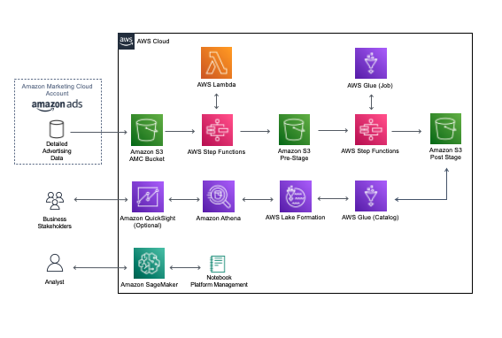

:xrefstyle: short

[#architecture1]
.Quick Start architecture for {partner-product-short-name} on AWS

This Quick Start deploys the {partner-product-short-name}, which contains the following four modules:

* *AWS DataOps Development Kit (DDK)*: This module is based on the open-source https://github.com/awslabs/aws-ddk[AWS DataOps Development Kit (DDK)^] of AWS Professional Services and configured to process advertising-related datasets in AMC.
* *Tenant Provisioning Service*: Part of the Client Manager MicroServices package, this module is an Amazon Ad Tech solution for managing multiple Amazon Marketing Cloud clients.
* *Workflow Management Service*: The Workflow Management Service is an Amazon Ad Tech solution for managing Amazon Marketing Cloud workflows.
* *Platform Notebook Manager*: This module contains sample Jupyter notebooks for Tenant Provisioning and Workflow Manager services.

For more information about AMC, see https://advertising.amazon.com/solutions/products/amazon-marketing-cloud[Amazon Marketing Cloud^].