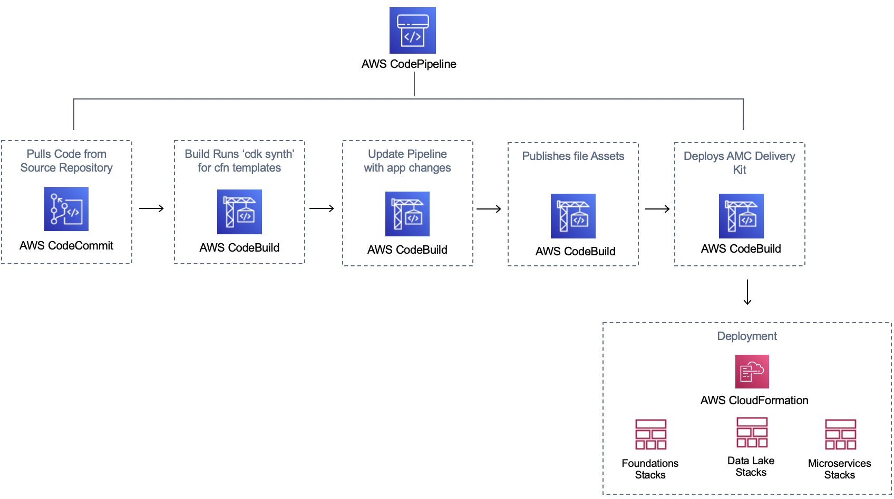
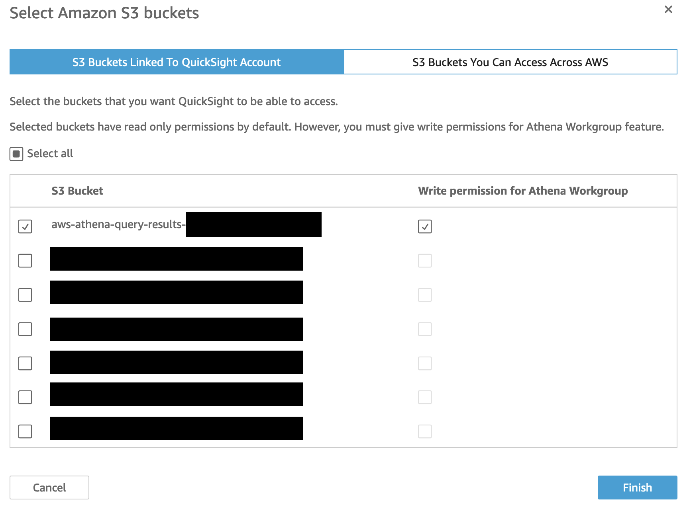
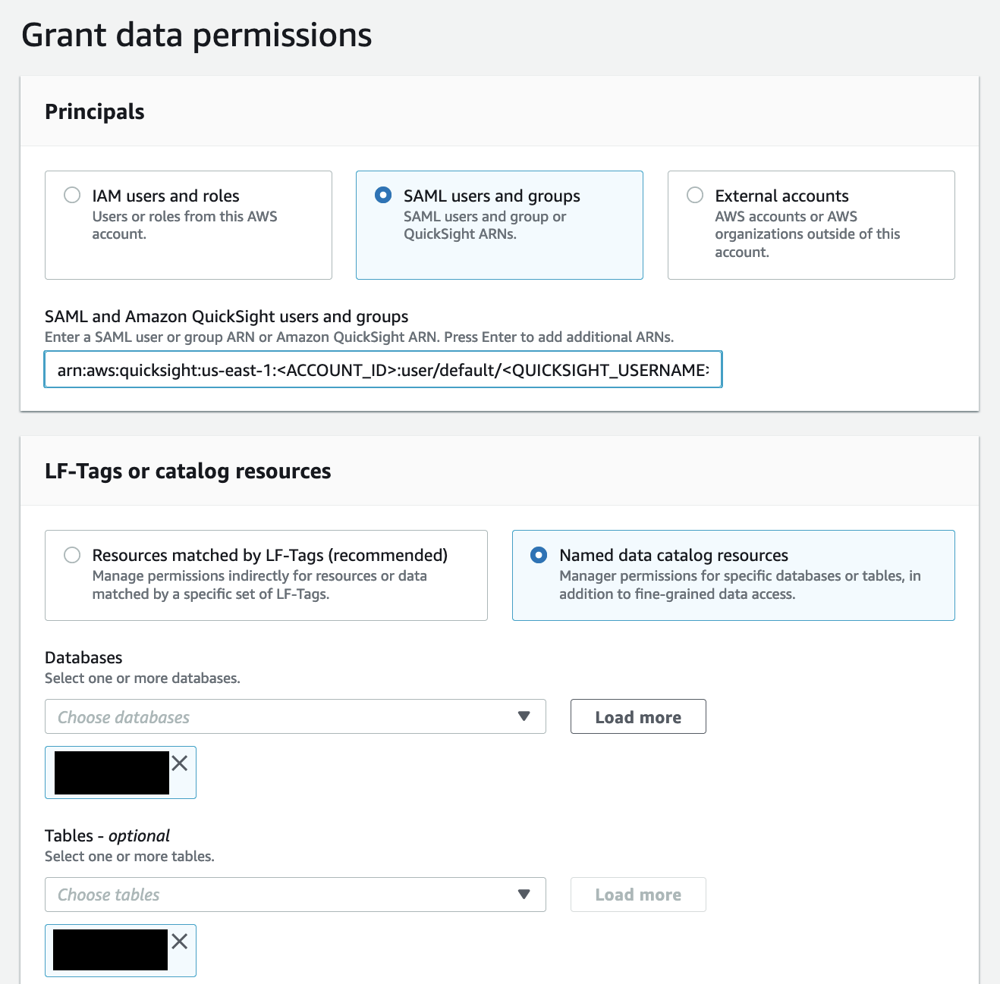

// Include any predeployment steps here, such as signing up for a Marketplace AMI or making any changes to a partner account. If there are no predeployment steps, leave this file empty.

== Predeployment steps
Follow each of the {partner-product-short-name} Deployment Steps:

. Setup Prerequisites
. Deploying the Foundational Infrastructure
. Initial setup with the DDK CLI
. Lake Formation Permissions

== Prerequisites for the Deployment

To complete this deployment, you'll need the following in your local environment

Programmatic access to an AWS Account
Python (version 3.7 or above) and its package manager, pip (version 9.0.3 or above), are required

```
$ python --version
$ pip --version
```

The AWS CLI installed and configured

```
$ aws --version
```

The AWS CDK CLI (version 2.10 and above) installed

```
$ cdk --version
```

The Git CLI installed and configured

```
$ git --version
```

If this is your first time using Git, set your git username and email by running:

```
$ git config --global user.name "YOUR NAME"
$ git config --global user.email "YOU@EMAIL.COM"
```

You can verify your git configuration with

```
$ git config --list
```


=== [OPTIONAL] Using AWS Cloud9 for Deployment

If you would like to deploy this quickstart using an AWS Cloud9 Environment rather than on your local environment, follow these steps to set up AWS Cloud9:

1. Log in to the AWS account console using the Admin role and select an AWS region. We recommend choosing a mature region where most services are available (e.g. eu-west-1, us-east-1…)
2. Navigate to `Cloud9` in the AWS console. Set up a [Cloud9 Environment](https://docs.aws.amazon.com/cloud9/latest/user-guide/create-environment-main.html) in the same AWS region (t3.small or higher, Amazon Linux 2) and open the IDE
3. Download the package, upload it to your Cloud9 instance, and unzip it
4. Install jq by running in your command line:

```
$ sudo yum install jq
```

Python, Pip, AWS CLI, AWS CDK CLI, and Git CLI packages should all be installed and configured for you by defualt in your Cloud9 environment. Ensure that these pacakges are installed with the correct version with the following commands:

```
$ python --version
$ pip --version
$ aws --version
$ cdk --version
$ git --version
```

The version requirements for the packages installed are:
Python (version 3.7 or above)
pip (version 9.0.3 or above)
AWS CDK CLI (version 2.10 and above)


Deploying the Foundational Infrastructure
=== Initial setup with the DDK CLI

#### Clone the repository for {partner-product-short-name}

```
$ git clone GITHUB-PATH
$ cd amc_quickstart
```

Install AWS DDK CLI, a command line interface to manage your DDK apps

```
$ pip install aws-ddk
```

To verify the installation, run:

```
$ ddk --help
```

Create and actitavte a virtualenv

```
$ python -m venv .venv && source .venv/bin/activate
```

Install the dependencies from requirements.txt
This is when the AWS DDK Core library is installed

```
$ pip install -r requirements.txt --no-cache-dir
```

If your AWS account hasn't been used to deploy DDK apps before, then you need to bootstrap your environment:

```
$ ddk bootstrap --help
$ ddk bootstrap --profile [AWS_PROFILE] --trusted-accounts [AWS_ACCOUNT_ID]
```

You might recognize a number of files typically found in a CDK Python application (e.g. app.py, cdk.json...). In addition, a file named ddk.json holding configuration about DDK specific constructs is present. Edit the DDK file with right account id, the name of the CodeCommit repository to reference (you will create this repository at a later step)and other data lake parameters (i.e. app, org, team, dataset, and pipeline names).

```
$ Edit ddk.json
```

Initialise git for the repository

```
$ git init --initial-branch main
```

Execute the create repository command to create a new codecommit repository

_(Make Sure the AMC_QUICKSTART_REPO_NAME matches the `repository` name value in the `ddk.json` configuration file before executing)_

```
$ ddk create-repository AMC_QUICKSTART_REPO_NAME --profile [AWS_PROFILE] --region [AWS_REGION]
```

Add and push the initial commit to the repository

```
$ git config --global credential.helper "!aws codecommit --profile <my-profile> credential-helper $@"
$ git config --global credential.UseHttpPath true
$ git add .
$ git commit -m "Configure AMC QUICKSTART"
$ git push --set-upstream origin main
```


=== Deploying the Foundational Infrastructure

Once the above steps are performed, run the deploy command to deploy the the Foundational Infrastructure.

```
$ ddk deploy --profile [AWS_PROFILE]
```

The deploy all step deploys an AWS CodePipeline along with its respective AWS CloudFormation Stacks. The last stage of each pipeline delivers the AMC Quickstart infrastructure respectively in the child (default dev) environment through CloudFormation.

image::../images/AMC-Quickstart-Deploy.png[AMC Quickstart Deployment Steps]

_Foundations:_ This application creates the foundational resources for the quickstart. These resources include Lambda Layers, Glue Jobs, S3 Buckets, routing SQS Queues, and Amazon DynamoDB Tables for data and metadata storage.

_Data Lake:_ This application creates the resources for the data lake. All the resources needed for orchestration between services and data processing code are provisioned here.

_Microservices:_ This application creates the resources for the supporting Microservices. All the resources needed for orchestration between the microservices, data processing code, and data and metadata storage for the microservices are provisioned here.

For a walkthrough of the steps the AWS CodePipeline goes through to deploy these resources please refer to [here](#amc-quickstart-codepipeline-steps).

_NOTE:_ If deploying in a new AWS Account, the Assets stage of the CodePipeline may fail due to limitations for the number of concurrent file assets to publish. This is a current limitation of AWS CodeBuild. To fix, click the `Retry` button in CodePipeline for the Assets Stage. This will manually continue the Assets Stage to continue building file assets from its most current progress.


=== Enable Default Lake Formation Permissions
In order to query the data in Athena, we highly recommend you enable default Lake Formation Permissions and give your current IAM Role permisssion in AWS Lake Formation. Enabling AWS Lake Formation Permissions helps to build, secure, and manage your data lake quickly and efficiently. Follow the below steps in order to enable Lake Formation and grant your Role the correct permissions:

. In your AWS Account Console go to the AWS Lake Formation page
. In the navigation pane, under Data catalog, choose Settings

   .. Clear both check boxes and choose Save (you have now enabled Lake Formation to control your Data Catalog resources)

. In the navigation pane under Permissions, choose Data Lake Permissions

   .. Click the Grant Button on the upper right corner

   .. For **IAM users and roles** enter your current IAM Role

   .. For **LF-Tags or catalog resources** select Named data catalog resources

      ... For **Databases**, select your database with name: `aws_datalake_{environment}_{team}_{name}_db"` (default name is `aws_datalake_dev_demoteam_amcdataset_db`)

      ... For **Tables**, select `All Tables`

      ... Leave `Data Filters - Optional` Empty

   .. For **Table Permissions** select `Super`

   .. Click Grant at the bottom of the page to create your Lake Formation Permissions

You have enabled Lake Formation permissions and given your IAM Role permissions to access all tables in your Glue Database. You are now able to access the data returned from your workflow execution using Amazon Athena once the data is uploaded and processed in the data lake.


== CodePipeline Steps



The Code Pipeline Steps are:

- Source → Pull code from the source CodeCommit Repository
- Build → Runs `cdk synth` to translate CDK defintions into CloudFormation Template Definitions
- UpdatePipeline → Automatically update if new CDK applications or stages are added in the source code
- Assets → Publish CDK Assets
- AMCQuickstart → Prepares and Deploys all of the Resources in CloudFormation Stacks, including:
    - Foundational Resources
    - Data Lake Resources
    - Microservice Resources

== Hydrating the Data Lake with SageMaker Notebooks

To hydrate the data lake and begin populating the data lake with data from your AMC Instance, follow the steps below:

. Log In to your AWS Account and go to Amazon SageMaker
. On the Left Side of Your Screen Click on Notebook --> Notebook Instances (you should see one notebook named `saw-platform-manager` with Status "InService")
. Click "Open JupyterLab" to open the Notebook Instance in a new tab
. Right click the `Getting_Started_With_AMC_Quickstart.ipynb` Notebook in the `platform_manager` folder
   .. Duplicate the Notebook
   .. Follow the steps in the notebook to hydrate the data lake.

**This Notebook will cover the following:**

_Insert TPS Records:_ To initialize the process of onboarding your AMC instance on the Amazon AD Tech platform, this notebook will walk through the steps to adds client configurations to a TPS Customer Configuration table in Amazon DynamoDB. The configuration includes your AMC Endpoint URL, AMC Bucket Name and other related information on your AMC Instance. The Tenant Provisioning Service (TPS) will then automatically:

- Onboard clients using configuration which is persisted in a DynamoDB Table. It helps to reduce time to onboard new customers
- Provide functionality to automatically enable different modules (AMC/Sponsored ADs/DSP) during the onboarding process for each client
- Provide a centralized location to manage various clients and modules and supports multi-tenancy

_Create Workflows:_ To initialize the creation, scheduling and execution of AMC workflows, this notebook will walk through the steps to add a workflow to an AMC Workflows table in Amazon DynamoDB. From there you will also invoke this workflow to execute and populate data from your AMC Instance to your AMC S3 Bucket. WFM also allows you to:

- Automatically trigger the deployment of the SQS queues, IAM policies, workflows and workflow schedules in WFM for the customer's AMC instance upon adding or updating a customer record to the Tenant Provisioning Service (TPS)
- Synchronize workflows and workflow schedules in the Workflow Library service with multiple AMC Instances
- Send execution requests to an SQS queue rather than directly to the AMC endpoint to prevents timeout failures when there are large number of requests in a short period of time
- Scheduled with dynamic relative time windows rather than using AMC's scheduling feature which only allows predefined scheduled reporting such as Daily or Weekly
- Track the status of all workflow executions for customer AMC instances whether they are submitted through WFM or other means (postman, etc.). Having the status synced to DynamoDB allows events to be triggered or notifications to be sent when executions change state. This table can also be used to track historical executions for troubleshooting or performance monitoring.

== Building Your First QuickSight Dashboard
The following section walks you through how to build a QuickSight dashboard with a report from Amazon Marketing Cloud (AMC). With AMC enabling advertisers to query event level data within a privacy friendly environment and Amazon QuickSight offering users a cloud-powered business analytics service to build visualizations, perform ad-hoc analysis, and quickly get business insights from their data - you can begin to build out a business intelligence strategy. 

Advertisers can use QuickSight to analyze reports from AMC to identify valuable insights and then scheduling, publishing dashboards to provide marketing insights in one central location. Custom-built dashboards can pull from a series of custom workflows built on a scheduled cadence. 

Note: As a prerequisite, you should have executed at least one Time to Conversion query against AMC. The result will be used in this section to populate a QuickSight visualization.

=== Initial QuickSight Setup
You will need author access to a QuickSight Account to get started with building your first dashboard. If you don't have a QuickSight account already, below are the steps to create one.

[start=1]
. Launch the **AWS Console** (https://console.aws.amazon.com) in a new browser tab, search for **QuickSight** and launch it.
. On the **QuickSight** page, click **Sign up for QuickSight** button.
. Keep the default **Enterprise** edition, scroll down and click the **Continue** button.
. Enter a **QuickSight account name** & **Notification email address**. Enter your official email as the notification email.
. Scroll down and click the **Finish** button. (It can take 15-30 Secs to set up the account)
. Click the **Go to Amazon QuickSight** button. You will now be taken to QuickSight console.

=== Authorize Your QuickSight Connection
To work with Lake Formation and Athena, make sure that you have AWS resource permissions configured in Amazon QuickSight:

* Enable access to Amazon Athena.
* Enable access to the correct buckets in Amazon S3 Usually S3 access is enabled when you enable Athena. However, because you can change S3 permissions outside of that process, it's a good idea to verify them separately

Use the following procedure to make sure that you successfully authorized Amazon QuickSight to use Athena. Permissions to AWS resources apply to all Amazon QuickSight users.

To perform this action, you must be an Amazon QuickSight administrator. To check if you have access, verify that you see the Manage QuickSight option when you open the menu from your profile at upper right.

For more information, review: https://docs.aws.amazon.com/quicksight/latest/user/lake-formation.html 

**To authorize Amazon QuickSight to access Athena and Amazon S3:**

[start=1]
. Choose your profile name (upper right). Choose **Manage QuickSight**, and then choose **Security & permissions**.
. Under **QuickSight access to AWS services**, choose **Manage**.
. Find **Athena** in the list. Clear the box by Athena, then select it again to enable Athena. Then choose **Next**.
. Under **S3 Bucket**, choose the S3 buckets that you want to access from Amazon QuickSight.



[start=5]
. From the right column, **Write permission for Athena Workgroup**, choose the S3 buckets you could write your Athena results too.
. Choose **Finish** to confirm your selection or choose **Cancel** to exit without saving.
. Click **Save**, to update your new settings for Amazon QuickSight access to AWS services or choose **Cancel** to exit without making any changes.

**To authorize Amazon QuickSight through AWS Lake Formation:**

[start=1]
. Collect the Amazon Resource Names (ARNs) of the Amazon QuickSight users and groups that need to access the data in Lake Formation. These users should be Amazon QuickSight authors or administrators.
.. Use the AWS CLI to find user ARNs or you can construct the ARNs for each user manually.
.. To construct manually, replace **REGION_NAME**, **ACCOUNT_ID**, and **QUICKSIGHT_USERNAME**:
 ```arn:aws:quicksight:<REGION_NAME>:<ACCOUNT_ID>:user/default/<QUICKSIGHT_USERNAME>```
.. To collect user ARNs programmatically, run the following list-users command in your terminal (Linux or Mac) or at your command prompt (Windows): ```aws quicksight list-users --aws-account-id 111122223333 --namespace default --region us-east-1```
... Note: to find your QuickSight username, click the menu in the top right portion of the page.

image::../images/quicksight-username.png[QuickSightUsernameView]

[start=2]
. Next, Sign in to the AWS Console and navigate to AWS Lake Formation as the data lake administrator. A data lake administrator can grant any principal (IAM, QuickSight, or Active Directory) permissions to Data Catalog resources (databases and tables) or data lake locations in Amazon S3.
. Choose **Databases**.
. Select the circle next to the database you want to grant access to your QuickSight user.
. From the **Actions** drop-down menu, choose **Grant**.
. Select **SAML users and groups** and enter the QuickSight user ARN.
. Then click into **Named data catalog resources**



[start=8]

. Under Tables, open the drop-down menu and select All tables or selectively choose individual tables to permission access to. 
. For **Table permissions**, choose **Select** and **Describe**.
. Then click **Grant**.
. Repeat the preceding steps to grant multiple database permissions to your QuickSight user ARN or other users and groups.


=== Query & Visualize Your First AMC Use Case 
In this section, you'll step through how to build and analyze a visualization for the Time to Conversion use case.

#### Overview

Advertisers may typically ask - how long does it takes for our customers to convert after last seeing our ad? This use case will enable you with the dimensions and metrics to answer that question. 

It is important to understand how long it takes customers who see your ad to complete the conversion, and how that impacts the data you see in your conversion report. Sometimes the conversions happen rapidly, within a few minutes and other times, it might take days for your customers to complete the purchase. You can use this information to adjust the duration of your campaign and promotion to maximize sales.


.Key Performance Indicators (KPIs)
:===
KPI : Definition

Time to Conversion:The amount of time customers take from last seeing your ad to purchase. The time has been converted to minutes, hours and days from seconds in the query template. You may adjust it based on your use case.

Purchases:The number of times any amount of a promoted product or products are included in a purchase event. Purchase events include video rentals and new Subscribe & Save subscriptions. Sum of purchases from users_that_purchased.

Total Brand Purchases:The number of times any number of products are included in a single purchase event. Purchase events include Subscribe & Save subscriptions and video rentals. This counts purchases for promoted products as well as products from the same brands as the products tracked in the order. (Total purchases = Purchases + Purchases Brand Halo)
:===


#### Creating the Visualization:
This section provides details on how to create a visualization for the Time to Conversion use case in Amazon QuickSight.

[start=1]
. Begin by creating a new dataset. Choose **Datasets** from the navigation pane at left, then choose **New dataset**.
. Next, connect to an Athena Data Source with either a using an existing connection profile (more common) or by creating a new one.
.. To use an existing Athena connection profile, scroll down to the **FROM EXISTING DATA SOURCES** section, and choose the card for the existing data source that you want to use. Choose **Create dataset**. Cards are labeled with the Athena data source icon and the name provided by the person who created the connection.
.. Next, create a new Athena connection profile, use the following steps:
... In the **FROM NEW DATA SOURCES** section, choose the **Athena** data source card.
... For **Data source name**, enter a descriptive name
... For **Athena workgroup**, choose your workgroup
... Choose **Validate connection** to test the connection
... Choose **Create data source**.

image::../images/quicksight-athena-workgroup.png[QuickiSightAthenaWorkgroup]

[start=3]

. On the **Choose your table screen**, do the following:
.. For **Catalog**, choose **AwsDataCatalog**.
.. Choose one of the following:
... To choose the database and table created for the Time to Conversion use case, choose your database from the dropdown under **Database** and choose the Time to Conversion table from the **Tables** list that appears for your database.
... You can optionally pull the data in with a SQL query, by choosing **Use custom SQL**

image::../images/quicksight-table-selection.png[QuickSightTableSelection]

[start=4]

. Choose **Select**
. Create a dataset and analyze the data using the table by choosing **Visualize**. 
.. In the **Fields list** pane, choose **purchases**, **time_to_conversion**, and **total_brand_purchases**.
.. Amazon QuickSight uses AutoGraph to create the visual, selecting the visual type that it determines is most compatible with those fields. In this case, it selects a horizontal bar chart that shows the purchases and total_brand_purchases by time_to_conversion. 

image::../images/quicksight-time-to-conversion-autograph.png[QuickSightTimeToConversionAutoGraph]

[start=6]
. Modify the Auto Graphed visual
.. In the **Visual types** pane, select **Vertical bar chart** to rotate the chart.
.. Expand the **Field wells** pane by choosing the expand icon.
.. Choose the **X axis** field well, choose **Sort by**, and then choose **time_to_conversion**. 
.. Again from the **X axis** field well, select the **ascending** icon.
. Add a Title to the visual
.. On the visual's right, choose the **Format visual** icon.
.. In the **Format Visual** pane that opens on the left, choose the **Title** tab.
.. Choose **Edit title**
.. In the **Edit title** page that opens, type **Purchases by Time to Conversion**
.. When you're finished editing, choose **Save**.
. Change the x-axis label
.. Again, in the **Format Visual** pane open on the left, choose the **X-axis** tab.
.. In the text box below **time_to_conversion**, enter in **Time to Conversion**.
.. Close the **Format Visual** pane by choosing the X icon in the upper-right corner of the pane.
. Add data labels to your chart
.. Next, in the **Format Visual** pane open on the left, choose the **Data Labels** tab.
.. Check the box to the left of **Show data labels** to show and customize labels.
.. Close the **Format Visual** pane by choosing the X icon in the upper-right corner of the pane.
. Add Filters
.. On the far left pane, choose **Filter**
.. Then in the Filters pane, choose the **+** in the top right corner.
.. Select **advertiser**, then repeat for **campaign** and **file_last_modified**
. Use a combination of the filters to analyze the performance by time period, to identify windows with the highest conversion rates.

image::../images/quicksight-time-to-conversion.png[QuickSightTimeToConversion]
Vertical Bar Chart visual in Amazon QuickSight for the Purchases by Time to Conversion AMC use case

For further information on customizing visualizations checkout: https://docs.aws.amazon.com/quicksight/latest/user/working-with-visuals.html

//== Best practices for using {partner-product-short-name} on AWS
// Provide post-deployment best practices for using the technology on AWS, including considerations such as migrating data, backups, ensuring high performance, high availability, etc. Link to software documentation for detailed information.

//_Add any best practices for using the software._

//== Security
// Provide post-deployment best practices for using the technology on AWS, including considerations such as migrating data, backups, ensuring high performance, high availability, etc. Link to software documentation for detailed information.

//_Add any security-related information._

//== Other useful information
//Provide any other information of interest to users, especially focusing on areas where AWS or cloud usage differs from on-premises usage.

//_Add any other details that will help the customer use the software on AWS._


== Cleaning Up the {partner-product-short-name}

Once the solution has been deployed and tested, use the following command to clean up the resources deployed:

```
$ make delete_all
```

_NOTE:_ Before running this command, look into the `Makefile` and ensure that:

1.  The `delete_repositories` function is passing the correct `-d AMC_QUICKSTART_REPO_NAME` (default: `ddk-amc-quickstart`)

2.  The `delete_bootstrap` function is passing the correct `--stack-name BOOTSTRAP_STACK_NAME` (default: `DdkDevBootstrap`)

This command will go through the following sequence of steps in order to clean up your AWS account environment:


Some CloudWatch General Log Groups May Remain in your Account with Logs specific to AMC Quickstart resources, including:

- /aws/sagemaker/NotebookInstances
- /aws-glue/jobs/error
- /aws-glue/jobs/output
