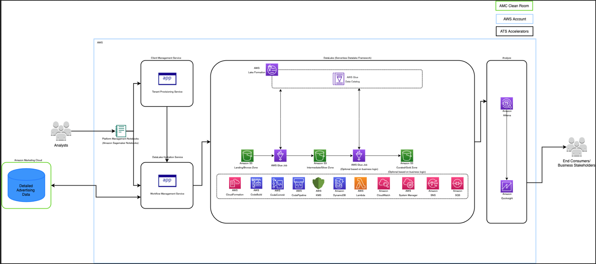

:xrefstyle: short

Deploying this Quick Start for a new virtual private cloud (VPC) with
default parameters builds the following {partner-product-short-name} environment in the
AWS Cloud.

[#architecture1]
.Quick Start architecture for {partner-product-short-name} on AWS

As shown in <<architecture1>>, the Quick Start sets up the following:

* DataLake (serverless data framework) +
The SDLF is a collection of production-hardened, best practice templates that accelerate the data lake implementation AWS. As part of this framework a number of AWS services are configured. Please review the details link:https://github.com/awslabs/aws-serverless-data-lake-framework[here]
* DataLake Hydration service +
The workflow management microservice is an Amazon Adtech solution to automate the creation scheduling and execution of AMC workflows to hydrate the datalake with aggreagted AMC data for performing custom analysis. The following AWS services are configured as part of this module - AWS Lambda, S3, Amazon Cloudwatch, Amazon DynamoDB, AWS Identity and Access Management (IAM), Amazon Simple Queue Service, Amazon Simple Notification Service and AWS Key Management Service (KMS)
* Client Management service +
The client management microserivce is an Amazon Ad Tech solution that adds functionality for managing multiple AMC clients and works in conjuction with the workflow management service to pull the relevant data. The following services are configured as part of this microserivce deployment - AWS Lambda, S3, Amazon Cloudwatch, Amazon DynamoDB, AWS Identity and Access Management (IAM), AWS Step Functions, Amazon Simple Queue Service, Amazon Simple Notification Service, AWS Key Management Service (KMS)
* Platform Management Notebooks +
These are sample jupyter notebooks which will help to interact and get started with using the Tenant Provisioning Service and Workflow Manager Service.This following services are configured - Amazon Sagemaker Notebook instance, AWS Key Management Service (KMS)
* Services for data analysis +
Amazon Athena is configured as part of this module. Sample queries are provided below to query the data from the datalake. Detailed instructions to configure Quicksight are also provided below along with prebuilt sample dashboard for analysis.